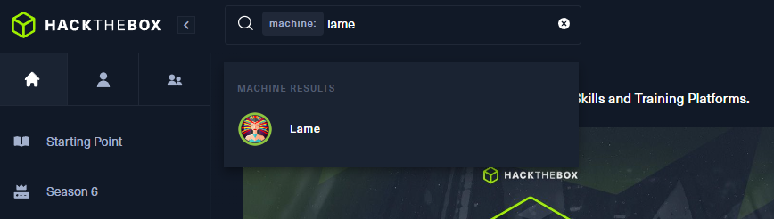

# Lame Walkthrough
This walkthrough is written primarily to guide members of the Hack The Box Meetup: Calgary, CA. Credit to IppSec for the solution. This written walkthrough is made of up from IppSec's solution, with supplementary notes to help with the Meetup walkthrough.

# Setup
1. Start your Virtual Machine. Preferably using a hacking focused OS such as Kali or Parrot OS.
2. Login to Hack The Box Labs
3. In the search bar type "machine:" and then "Lame". Click on the machine result "Lame".

